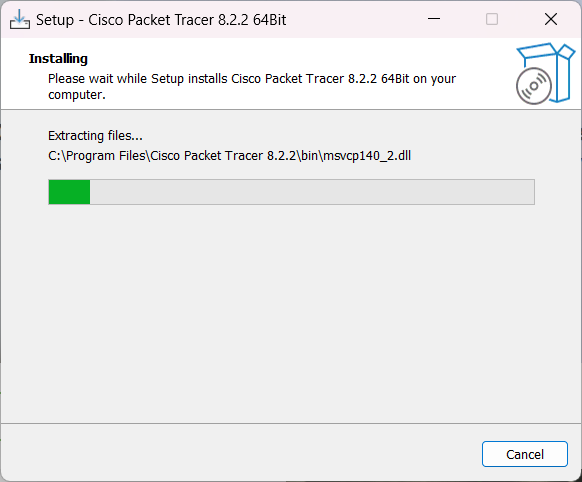
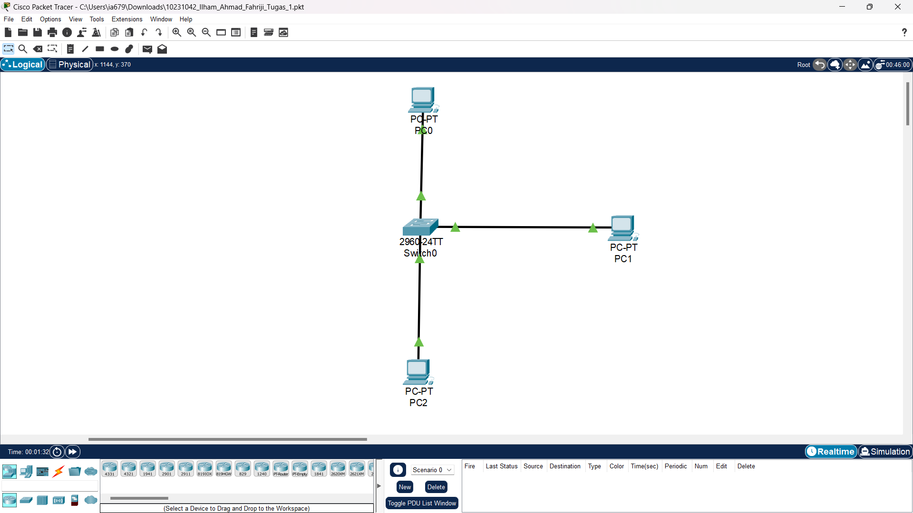
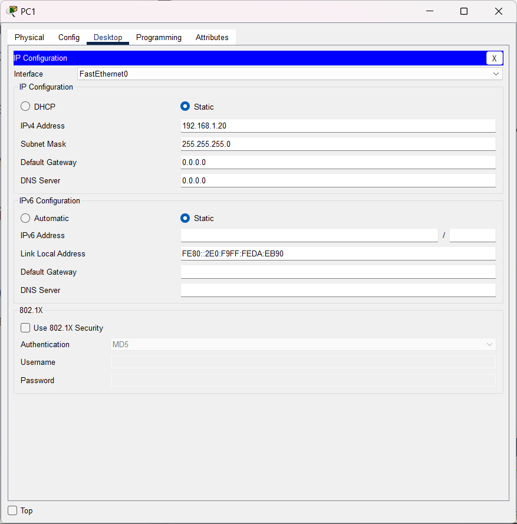
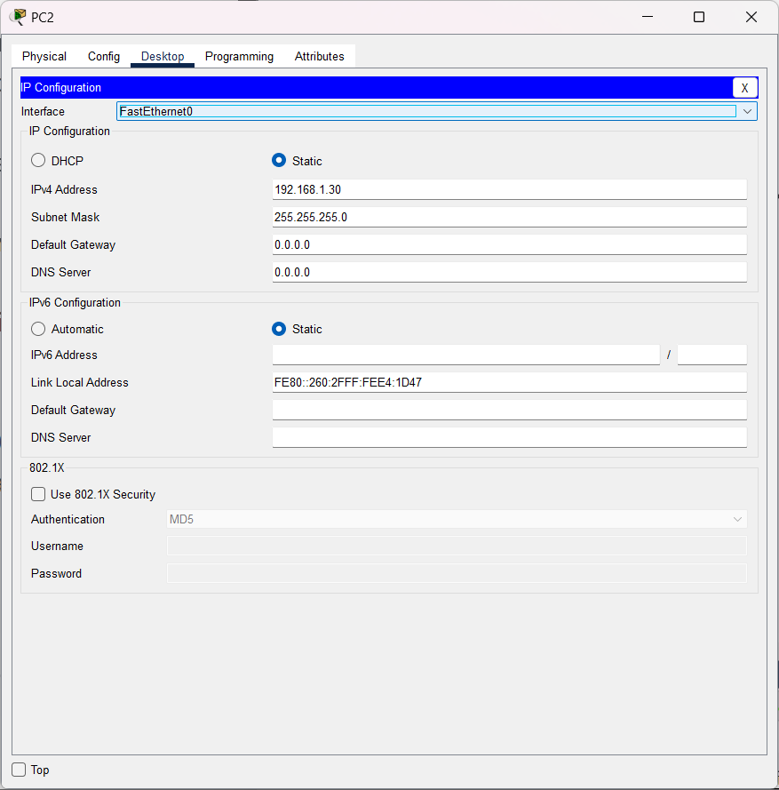
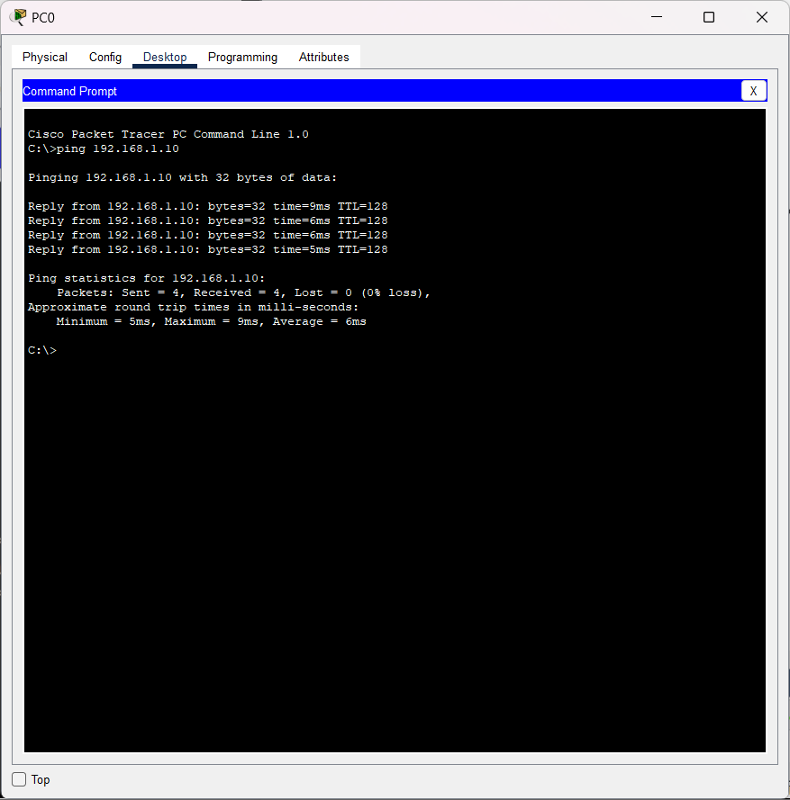
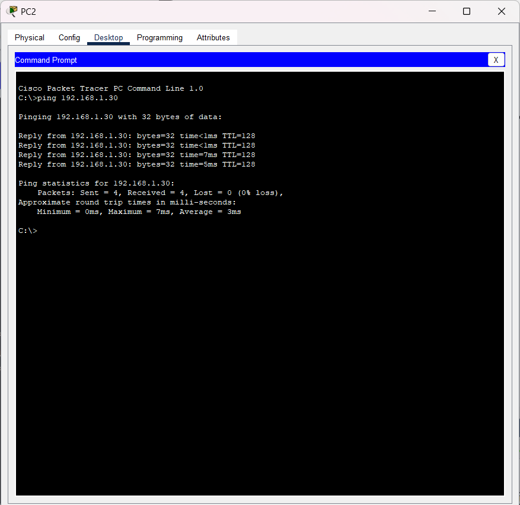
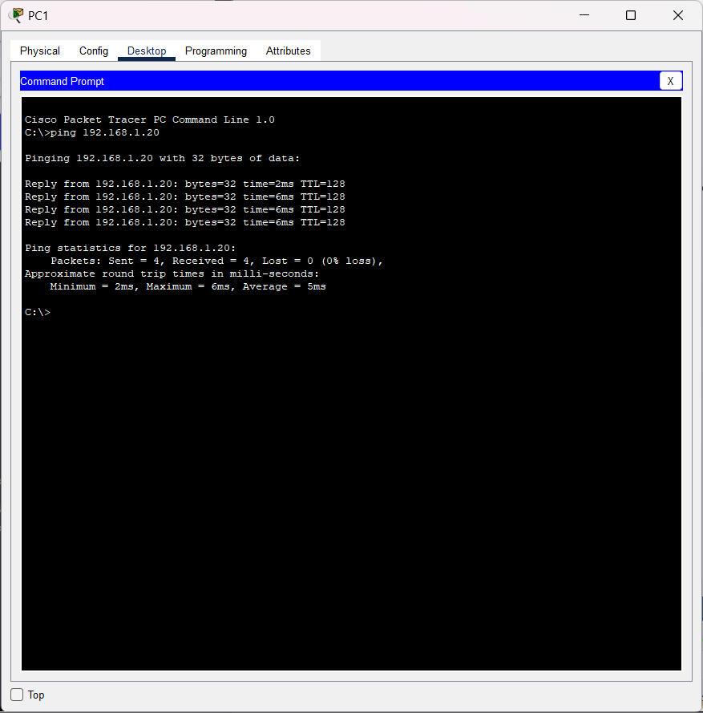

### Name : Ilham Ahmad Fahriji

## NIM : 10231042

## Prodi : Sistem Informasi

1. **Proses Instalasi Cisco Packet Tracer**  
   Langkah instalasi Cisco Packet Tracer dilakukan secara sistematis dan berhasil tanpa kendala.

2. **Pembuatan Topologi Jaringan**  
   Setelah instalasi, topologi dibuat dengan menghubungkan dua PC (PC0 dan PC1) serta satu switch (Switch0). Kondisi LED yang menyala hijau pada tiap port menunjukkan sambungan fisik yang valid.

3. **Pengaturan IP Address dan Subnet Mask**  
   Konfigurasi alamat IP dan subnet mask disetting di masing-masing PC sesuai detail berikut:

   | PC  | IP Address   | Subnet Mask   |
   | --- | ------------ | ------------- |
   | PC0 | 192.168.1.10 | 255.255.255.0 |
   | PC1 | 192.168.1.20 | 255.255.255.0 |
   | PC2 | 192.168.1.30 | 255.255.255.0 |

4. **Pengujian Konektivitas dengan Ping**  
   Ping test dilakukan dengan menjalankan perintah `ping 192.168.1.10` di PC0 dan `ping 192.168.1.20` di PC1 dan `ping 192.168.1.30` di PC3. Ketika PC0 mengirim ICMP Echo Request ke PC1, respon berupa “Reply from 192.168.1.20” diterima. Proses komunikasi ini meliputi:

   - PC0 memastikan bahwa tujuan berada dalam jaringan lokal dengan menggunakan subnet mask.
   - Melalui ARP Request yang disebar oleh switch, MAC Address PC1 ditemukan.
   - Frame Ethernet yang memuat ICMP Echo Request dikirim ke PC1 melalui switch.
   - PC1 membalas dengan mengirimkan ICMP Echo Reply ke PC0, menunjukkan bahwa komunikasi berhasil tanpa gangguan.

5. **Perubahan Bentuk Data di Setiap Lapisan OSI**  
   Saat data dikirim oleh PC0 ke PC1, bentuk data mengalami transformasi pada setiap lapisan OSI:

   - **Layer 7: Aplikasi**  
     • Data awal berupa informasi murni dari aplikasi pengguna, misalnya perintah ping atau permintaan HTTP.

   - **Layer 6: Presentasi**  
     • Data mengalami pengubahan format (encoding, enkripsi, atau kompresi) sehingga siap untuk transmisi.

   - **Layer 5: Sesi**  
     • Data dilengkapi dengan informasi sesi seperti inisiasi, pemeliharaan, atau penghentian komunikasi.

   - **Layer 4: Transportasi**  
     • Data dipecah menjadi segmen-segmen (untuk TCP) disertai header transport yang berisi port sumber dan tujuan, sequence number, dan checksum. Jika menggunakan UDP, data disebut datagram.

   - **Layer 3: Jaringan**  
     • Segmen disematkan header IP yang mencakup alamat IP sumber (PC0) dan tujuan (PC1), bersama dengan parameter seperti TTL.

   - **Layer 2: Data Link**  
     • Paket dari lapisan 3 dikemas menjadi frame dengan header berisi MAC Address sumber dan tujuan serta trailer untuk pengecekan kesalahan.

   - **Layer 1: Fisik**  
     • Frame dikonversi menjadi sinyal biner (0 dan 1) yang ditransmisikan melalui media fisik, seperti kabel atau gelombang radio.

Singkatnya, data yang dikirim dari PC0 ke PC1 melalui jaringan telah mengalami serangkaian transformasi: dari data asli di aplikasi, menjadi segmen, paket, dan frame, hingga akhirnya menjadi sinyal fisik untuk dikirimkan secara nyata.

[GitHub Profile](https://github.com/itshzlnust/DMJK-B)
