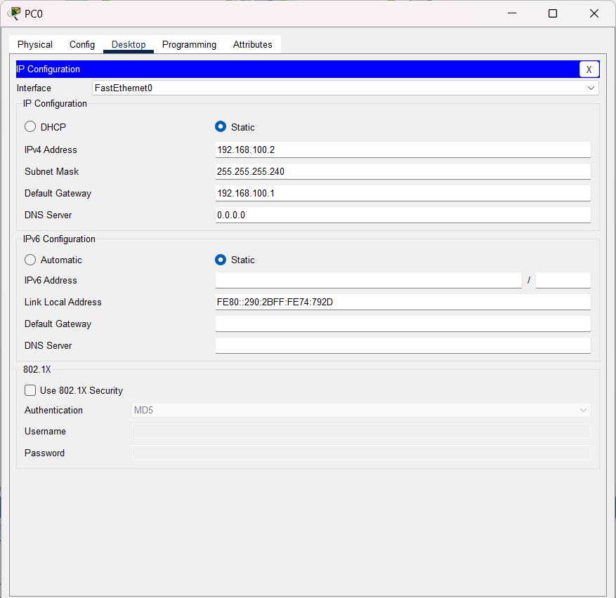

### Name : Ilham Ahmad Fahriji

## NIM : 10231042

## Prodi : Sistem Informasi

### Dokumentasi Hasil Praktikum

#### Tabel Perhitungan Subnet & CIDR

| Subnet Mask / CIDR | Network Address | Broadcast Address | Host Range          |
| ------------------ | --------------- | ----------------- | ------------------- |
| /29                | x.x.x.0         | x.x.x.7           | x.x.x.1 - x.x.x.6   |
| /30                | x.x.x.0         | x.x.x.3           | x.x.x.1 - x.x.x.2   |
| /24                | x.x.x.0         | x.x.x.255         | x.x.x.1 - x.x.x.254 |

#### Penjelasan Konsep

- **Subnetting:** Teknik pembagian jaringan IP menjadi beberapa subnet yang lebih kecil. Hal ini mempermudah pengelolaan dan meningkatkan keamanan serta efisiensi jaringan.
- **CIDR (Classless Inter-Domain Routing):** Metode untuk penulisan alamat IP dan subnets yang memungkinkan penggunaan ukuran subnet yang fleksibel.
- **Langkah-langkah Perhitungan:**
  1. Tentukan kebutuhan host untuk masing-masing subnet.
  2. Pilih subnet mask yang sesuai dengan jumlah host.
  3. Hitung network address, broadcast address, dan host range untuk setiap subnet.
- **Implementasi:** Setelah perhitungan, subnet yang telah ditentukan diimplementasikan pada perangkat jaringan untuk memastikan komunikasi yang efisien antar segmen jaringan.

### Contoh Perhitungan Subnet Mask dan CIDR

#### 1. Subnet /29

- **IP Awal:** 192.168.1.0
- **CIDR:** /29
- **Subnet Mask:** 255.255.255.248
- **Jumlah Bit Host:** 32 - 29 = 3 bit → 2³ = 8 alamat
- **Alamat Host yang Tersedia:** 8 - 2 = 6 (dikurangi network dan broadcast)
- **Perhitungan:**
  - **Network Address:** 192.168.1.0
  - **Broadcast Address:** 192.168.1.7
  - **Host Range:** 192.168.1.1 - 192.168.1.6

#### 2. Subnet /30

- **IP Awal:** 192.168.1.0
- **CIDR:** /30
- **Subnet Mask:** 255.255.255.252
- **Jumlah Bit Host:** 32 - 30 = 2 bit → 2² = 4 alamat
- **Alamat Host yang Tersedia:** 4 - 2 = 2
- **Perhitungan:**
  - **Network Address:** 192.168.1.0
  - **Broadcast Address:** 192.168.1.3
  - **Host Range:** 192.168.1.1 - 192.168.1.2

#### 3. Subnet /24

- **IP Awal:** 192.168.1.0
- **CIDR:** /24
- **Subnet Mask:** 255.255.255.0
- **Jumlah Bit Host:** 32 - 24 = 8 bit → 2⁸ = 256 alamat
- **Alamat Host yang Tersedia:** 256 - 2 = 254
- **Perhitungan:**
  - **Network Address:** 192.168.1.0
  - **Broadcast Address:** 192.168.1.255
  - **Host Range:** 192.168.1.1 - 192.168.1.254

#### Langkah-langkah Perhitungan Subnet

1. Tentukan jumlah host yang dibutuhkan untuk masing-masing segmen jaringan.
2. Hitung jumlah total alamat: Tambahkan dua alamat untuk network dan broadcast.
3. Tentukan nilai bit host (32 - CIDR) untuk mendapatkan jumlah total alamat pada subnet.
4. Sesuaikan IP awal dengan melakukan increment berdasarkan jumlah alamat per subnet.

[GitHub Profile](https://github.com/itshzlnust/DMJK-B)
