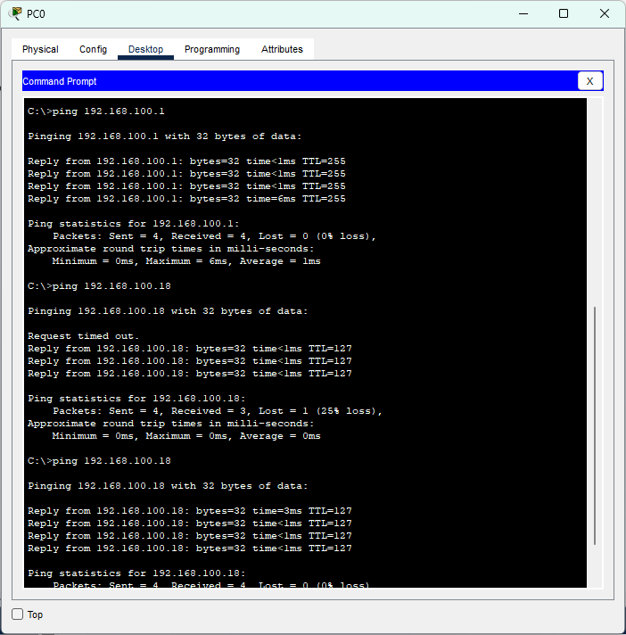
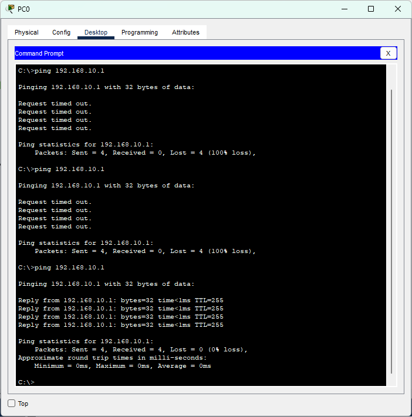

### Name : Ilham Ahmad Fahriji

## NIM : 10231042

## Prodi : Sistem Informasi

### Dokumentasi Hasil Praktikum

#### Diagram/Topologi Jaringan

- Gambar atau skema topologi jaringan yang digunakan dalam praktikum VLAN & Trunking.
- [Topologi Jaringan](./topologi.png)

#### Dokumentasi Perhitungan Subnet & Alokasi IP

- Tabel perhitungan subnet untuk masing-masing VLAN:

| VLAN | Network Address | Broadcast Address | Host Range      | Keterangan               |
| ---- | --------------- | ----------------- | --------------- | ------------------------ |
| 10   | 192.168.10.0    | 192.168.10.31     | 192.168.10.1-30 | Subnet /27 untuk VLAN 10 |
| 20   | 192.168.20.0    | 192.168.20.31     | 192.168.20.1-30 | Subnet /27 untuk VLAN 20 |
| ...  | ...             | ...               | ...             | ...                      |

- Penjelasan alokasi IP dan pembagian subnet sesuai kebutuhan jaringan.

#### Screenshot Konfigurasi

- **Konfigurasi VLAN pada Switch:**
  - Konfigurasi pembuatan VLAN.
  - Port assignment dan set-up trunk.
  - Contoh perintah konfigurasi:
    ```
    vlan 10
    name Marketing
    exit
    interface GigabitEthernet0/1
    switchport mode trunk
    switchport trunk allowed vlan 10,20
    ```
- **Konfigurasi Sub-interface pada Router (Jika Digunakan):**
  - Pengaturan sub-interface dan IP Address.
    ```
    interface GigabitEthernet0/0.10
    encapsulation dot1Q 10
    ip address 192.168.10.1 255.255.255.224
    ```
- **Konfigurasi IP Address:**
  - Sesuaikan dengan perhitungan subnet masing-masing VLAN.

#### Hasil Uji Konektivitas

- Sertakan screenshot hasil pengujian ping lintas VLAN.
- Contoh output CLI dari perintah ping:

  ```
  ping 192.168.20.1

  Reply from 192.168.20.1: bytes=32 time=2ms TTL=64
  Reply from 192.168.20.1: bytes=32 time=2ms TTL=64
  ```

  ### Perbandingan FLSM dan CIDR

  **Fixed Length Subnet Mask (FLSM)**

  - Menggunakan panjang subnet mask yang sama untuk semua subnet dalam jaringan
  - Membagi jaringan menjadi subnet dengan ukuran yang identik
  - Sederhana untuk implementasi dan pemahaman
  - Kurang efisien dalam penggunaan alamat IP karena setiap subnet mendapat jumlah alamat yang sama terlepas dari kebutuhan

  **Classless Inter-Domain Routing (CIDR)**

  - Memungkinkan subnet mask dengan panjang variabel sesuai kebutuhan
  - Subnet dapat memiliki ukuran yang berbeda-beda
  - Lebih efisien dalam penggunaan alamat IP karena alokasi berdasarkan kebutuhan aktual
  - Memungkinkan agregasi rute yang lebih baik, mengurangi ukuran tabel routing
  - Implementasi lebih kompleks tetapi memberikan fleksibilitas yang lebih tinggi

  Pada praktikum ini, pendekatan FLSM digunakan dengan subnet /27 untuk semua VLAN, namun dalam jaringan yang lebih kompleks, CIDR dapat memberikan efisiensi yang lebih baik.

  ### Konsep VLAN dan Trunking

  **Virtual LAN (VLAN)**

  - VLAN merupakan pembagian segmen logis dalam jaringan meskipun perangkat berada di lokasi fisik yang sama.
  - Membantu pemisahan domain siaran, meningkatkan keamanan, serta mengoptimalkan kinerja jaringan.
  - Setiap VLAN beroperasi secara independen, meminimalkan broadcast yang tidak perlu.

  **Trunking**

  - Trunking adalah metode untuk mengirimkan beberapa VLAN sekaligus pada satu koneksi fisik antara switch atau perangkat jaringan lain.
  - Menggunakan tagging (misalnya, IEEE 802.1Q) untuk menandai setiap frame agar penerima mengetahui VLAN asalnya.
  - Memudahkan manajemen jaringan dengan mengurangi jumlah kabel dan port yang diperlukan untuk menghubungkan banyak VLAN.

  #### Tautan Hasil Simulasi

  - [GitHub Profile](https://github.com/itshzlnust/DMJK-B)

- Simulasi dalam format PDF dan file .pkt dapat diakses melalui link tersebut.








