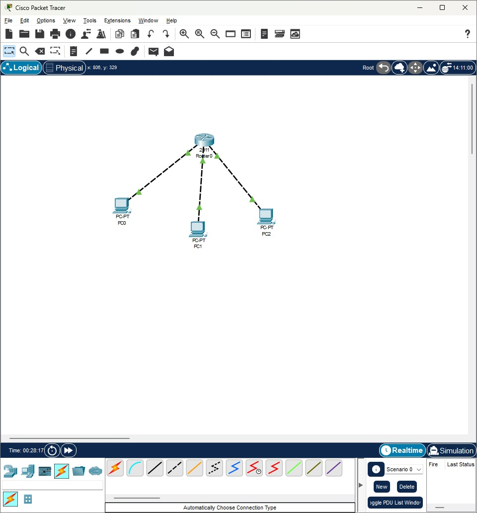
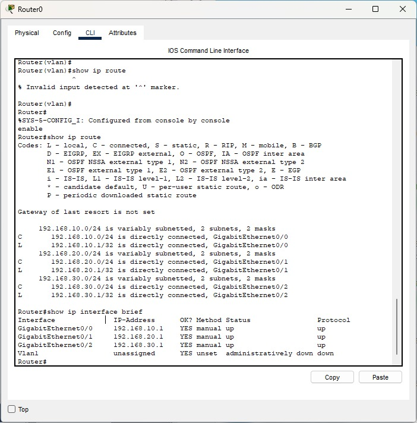
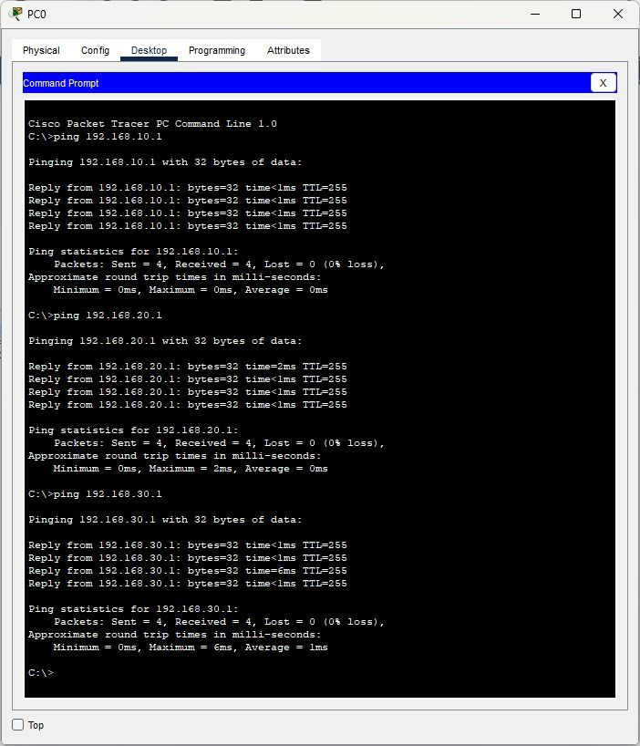
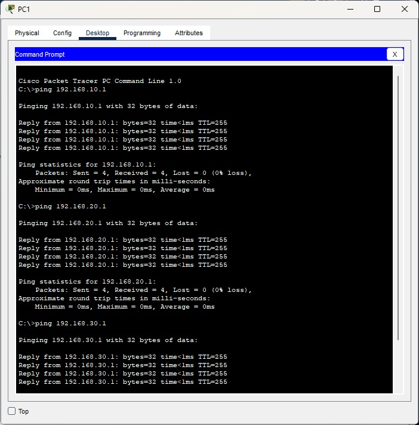
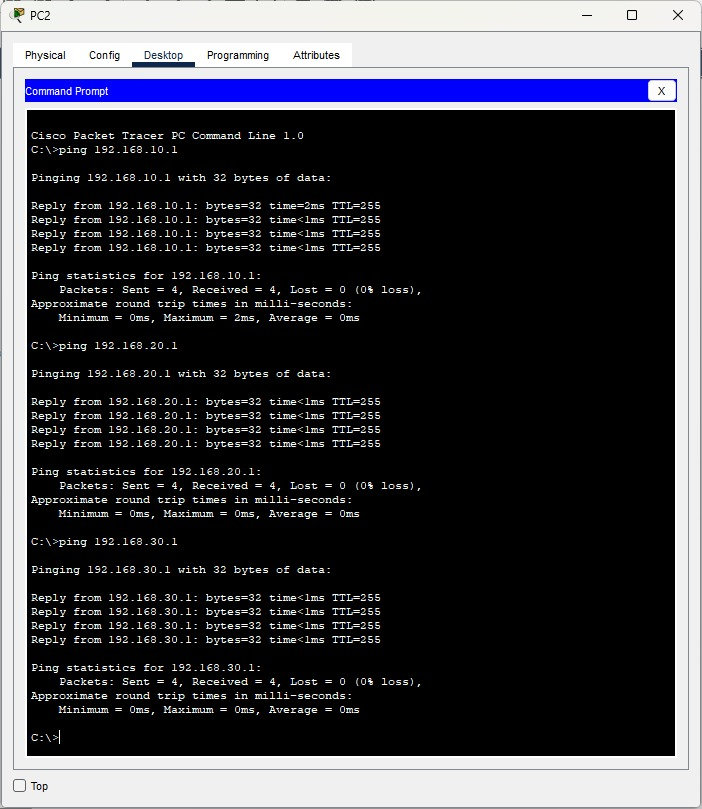
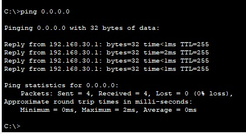

### Name : Ilham Ahmad Fahriji

## NIM : 10231042

## Prodi : Sistem Informasi

## Dokumentasi Hasil Praktikum Jaringan Komputer

### 1. Diagram/Topologi Jaringan

_Gambar 1: Topologi jaringan yang menunjukkan koneksi antar perangkat_

### 2. Tabel Konfigurasi

#### 2.1 Konfigurasi Alamat IP

| Perangkat | Interface | IP Address   | Subnet Mask   |
| --------- | --------- | ------------ | ------------- |
| Router1   | G0/0      | 192.168.10.1 | 255.255.255.0 |
| Router1   | G0/1      | 192.168.20.1 | 255.255.255.0 |
| Router1   | G0/2      | 192.168.30.1 | 255.255.255.0 |

#### 2.2 Konfigurasi Static Route

| Perangkat | Network Destination | Subnet Mask | Next Hop     |
| --------- | ------------------- | ----------- | ------------ |
| Router1   | 0.0.0.0             | 0.0.0.0     | 192.168.99.1 |

### 3. Screenshot Konfigurasi

#### 3.1 Output Konfigurasi Interface Router

Gambar 2: Output konfigurasi interface dari Router1

### 4. Hasil Pengujian

#### 4.1 Pengujian Ping Antar Subnet

Gambar 3: Hasil ping dari PC0 ke PC1 serta ke PC2

Gambar 4: Hasil ping dari PC1 ke PC0 serta ke PC2

Gambar 5: Hasil ping dari PC2 ke PC0 serta ke PC1 dan ke Default route

### 5. Penjelasan Singkat

#### 5.1 Langkah-langkah yang Dilakukan

1. Membangun topologi jaringan dengan menghubungkan satu router
2. Mengkonfigurasi alamat IP pada setiap interface router
3. Mengkonfigurasi static route pada router
4. Melakukan pengujian konektivitas dengan ping dan traceroute

#### 5.2 Permasalahan dan Solusi

- Permasalahan 1: Konektivitas antar subnet gagal setelah konfigurasi awal
  - Solusi: Memeriksa konfigurasi static route dan memperbaiki next hop address yang salah input
- Permasalahan 2: Interface router tidak aktif meskipun sudah dikonfigurasi
  - Solusi: Menggunakan perintah "no shutdown" pada interface untuk mengaktifkannya
- Permasalahan 3: Packet loss tinggi saat pengujian ping
  - Solusi: Memeriksa beban traffic dan melakukan optimasi parameter MTU

#### 5.3 Kesimpulan

Praktikum jaringan komputer ini berhasil mendemonstrasikan konfigurasi dasar routing statis pada perangkat router. Melalui praktikum ini, dapat dipahami bagaimana cara mengkonfigurasi alamat IP pada berbagai interface router, membuat static route untuk menghubungkan subnet yang berbeda, dan melakukan verifikasi konektivitas menggunakan perintah ping dan traceroute. Kemampuan troubleshooting juga terasah ketika menghadapi permasalahan konektivitas. Hasil praktikum menunjukkan bahwa konfigurasi yang tepat pada perangkat jaringan sangat penting untuk memastikan komunikasi data yang lancar antar subnet dalam jaringan.

#### 5.4 Traceroute - Penjelasan Konsep

Traceroute adalah sebuah utilitas jaringan yang digunakan untuk melacak jalur yang ditempuh oleh paket data dari sumber menuju ke tujuan di jaringan komputer. Berbeda dengan ping yang hanya mengecek konektivitas end-to-end, traceroute menunjukkan setiap hop (router) yang dilalui paket sepanjang jalur tersebut. Berikut cara kerja traceroute:

1. Traceroute mengirimkan paket dengan nilai TTL (Time To Live) yang dimulai dari 1
2. Setiap router yang dilalui akan mengurangi nilai TTL sebesar 1
3. Ketika TTL mencapai 0, router akan membuang paket dan mengirimkan pesan "Time Exceeded" kembali ke pengirim
4. Traceroute kemudian mengirim paket lain dengan TTL lebih tinggi (2, 3, dst.)
5. Proses ini diulang hingga paket mencapai tujuan akhir

Manfaat traceroute dalam troubleshooting jaringan:

- Mengidentifikasi di mana terjadi bottleneck atau masalah koneksi
- Memvisualisasikan jalur routing yang sebenarnya
- Mendeteksi router yang tidak responsif atau memiliki latency tinggi
- Memverifikasi bahwa routing berfungsi seperti yang diharapkan

Dalam praktikum ini, traceroute membantu memastikan bahwa static route yang dikonfigurasi telah bekerja dengan benar dan paket data mengikuti jalur yang sesuai.

### 6. Tautan Hasil Simulasi

- [GitHub Profile](https://github.com/itshzlnust/DMJK-B)
