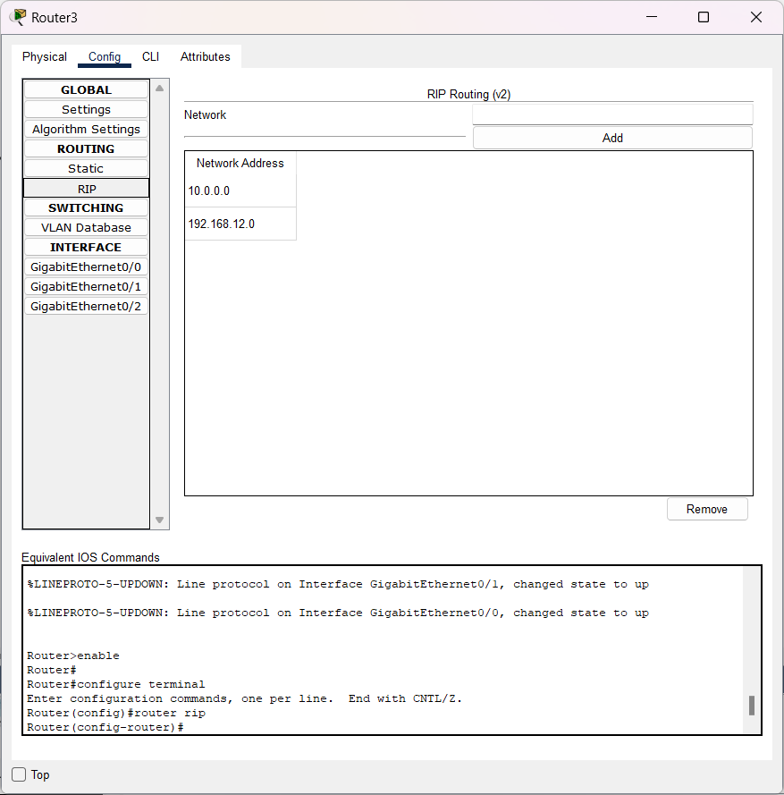

### Name : Ilham Ahmad Fahriji

## NIM : 10231042

## Prodi : Sistem Informasi

## Dokumentasi Hasil Praktikum Jaringan Komputer

### 1. Diagram/Topologi Jaringan


_Gambar 1: Topologi jaringan yang menunjukkan koneksi antar perangkat_

### 2. Tabel Konfigurasi

| Koneksi        | Subnet          | Alokasi IP                                       |
| -------------- | --------------- | ------------------------------------------------ |
| Link A-B       | 192.168.12.0/30 | Router A: 192.168.12.1<br>Router B: 192.168.12.2 |
| Link B-C       | 192.168.23.0/30 | Router B: 192.168.23.1<br>Router C: 192.168.23.2 |
| Subnet Lokal A | 10.0.1.0/24     | Interface Router A: 10.0.1.1                     |
| Subnet Lokal B | 10.0.2.0/24     | Interface Router B: 10.0.2.1                     |
| Subnet Lokal C | 10.0.3.0/24     | Interface Router C: 10.0.3.1                     |

### 3. Screenshot Konfigurasi

#### 3.1 Output Konfigurasi Interface Router


Gambar 2: IP route PC 1 yang terhubung


Gambar 3: IP route PC 2 yang terhubung


Gambar 4: IP route PC 3 yang terhubung

#### 3.2 Konfigurasi RIP dan OSPF

##### Routing Information Protocol (RIP)

RIP adalah protokol routing dinamis berbasis algoritma distance vector yang menggunakan hop count sebagai metrik untuk menentukan jalur terbaik. RIP memiliki karakteristik:

- Menggunakan algoritma Bellman-Ford
- Batas maksimum 15 hop (16 dianggap unreachable)
- Update routing tabel setiap 30 detik
- Cocok untuk jaringan kecil hingga menengah

**Konfigurasi RIP pada Router:**

```
Router> enable
Router# configure terminal
Router(config)# router rip
Router(config-router)# version 2
Router(config-router)# network 192.168.12.0
Router(config-router)# network 10.0.1.0
Router(config-router)# no auto-summary
Router(config-router)# exit
```

##### Open Shortest Path First (OSPF)

OSPF adalah protokol routing dinamis berbasis algoritma link-state yang menggunakan konsep area dan cost sebagai metrik untuk menentukan jalur terbaik. OSPF memiliki karakteristik:

- Menggunakan algoritma Dijkstra (SPF)
- Membentuk hubungan tetangga (adjacency) sebelum bertukar informasi
- Lebih efisien dalam bandwidth dibanding RIP
- Support untuk jaringan besar dengan konsep hierarki area
- Konvergensi lebih cepat daripada RIP

**Konfigurasi OSPF pada Router:**

```
Router> enable
Router# configure terminal
Router(config)# router ospf 1
Router(config-router)# network 192.168.12.0 0.0.0.3 area 0
Router(config-router)# network 10.0.1.0 0.0.0.255 area 0
Router(config-router)# exit
```

##### Perbandingan RIP dan OSPF

| Aspek                    | RIP             | OSPF             |
| ------------------------ | --------------- | ---------------- |
| Algoritma                | Distance Vector | Link State       |
| Metrik                   | Hop Count       | Cost (bandwidth) |
| Konvergensi              | Lambat          | Cepat            |
| Skalabilitas             | Rendah          | Tinggi           |
| Penggunaan CPU/Memory    | Rendah          | Tinggi           |
| Batas Hop                | 15              | Tidak terbatas   |
| Dukungan VLSM            | RIPv2 saja      | Ya               |
| Kompleksitas Konfigurasi | Rendah          | Tinggi           |

Dalam praktikum ini, RIP diimplementasikan untuk menghubungkan semua jaringan karena topologi yang digunakan relatif sederhana dan jumlah router masih dalam batas kemampuan RIP. Implementasi RIP memungkinkan semua subnet (10.0.1.0/24, 10.0.2.0/24, dan 10.0.3.0/24) dapat saling terhubung meskipun tidak terhubung langsung.



Gambar 5: Konfigurasi RIP pada Router A


Gambar 6: Konfigurasi RIP pada Router B


Gambar 7: Konfigurasi RIP pada Router C

### 6. Tautan Hasil Simulasi

- [GitHub Profile](https://github.com/itshzlnust/DMJK-B)
